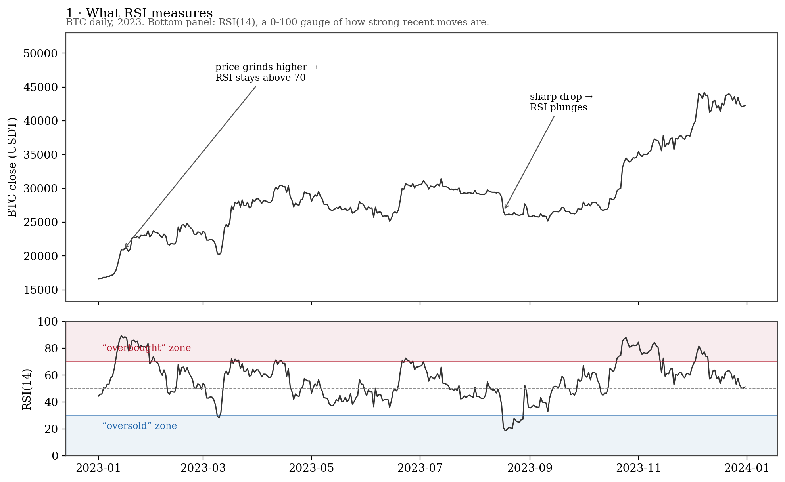
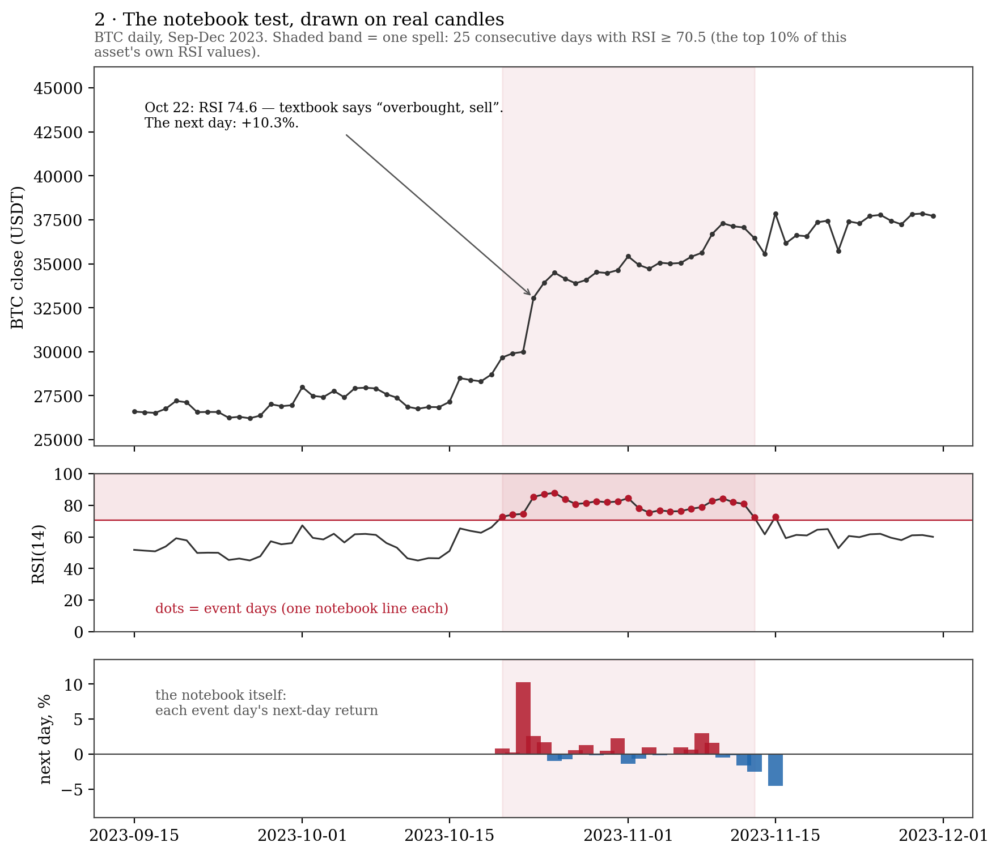
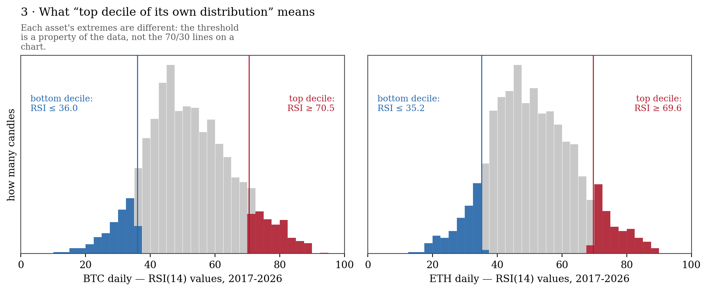
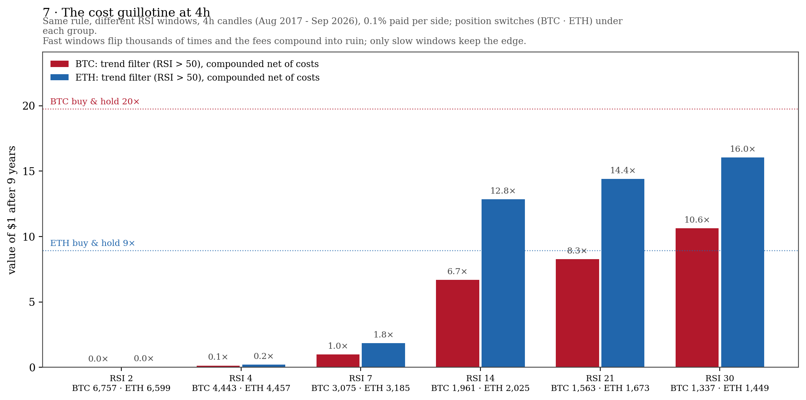
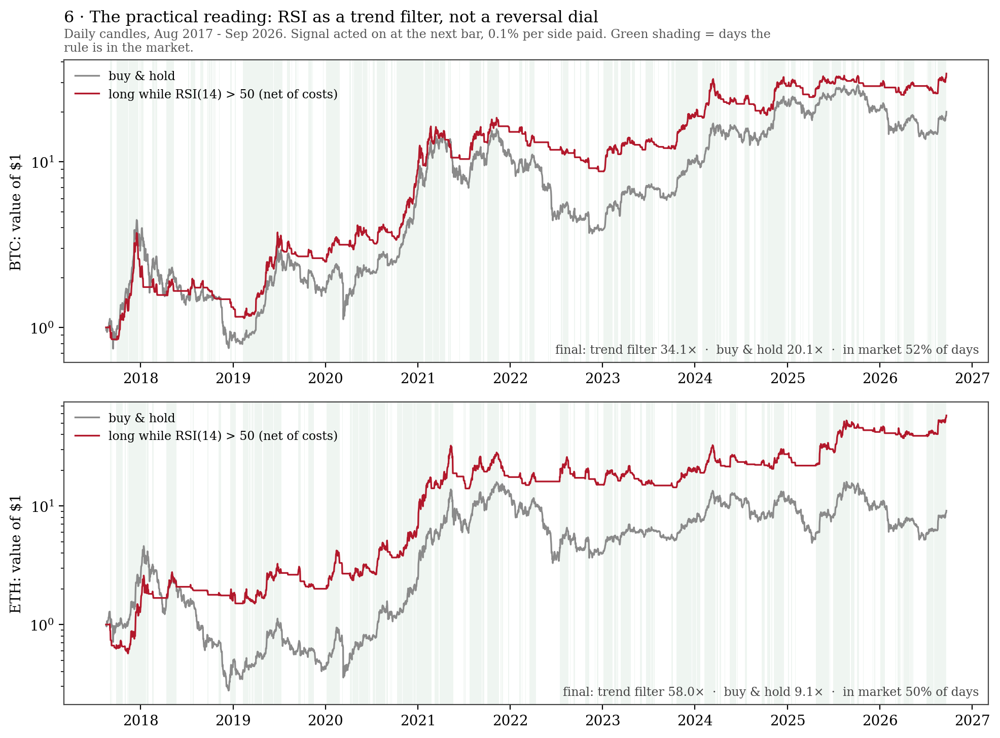
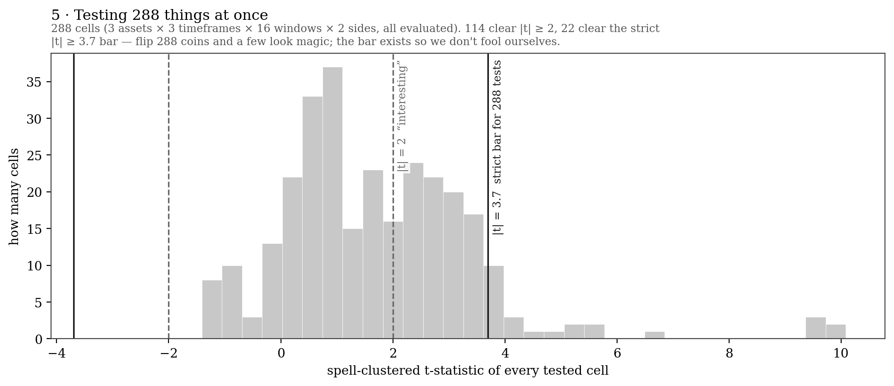
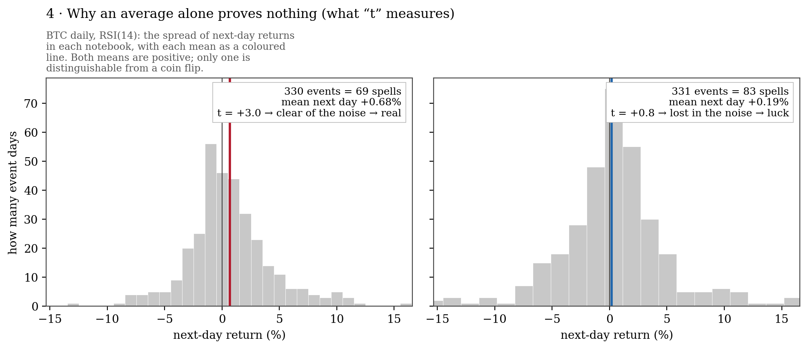

# When RSI was at an extreme, what did price do on the very next candle?

A study of RSI (and StochRSI) on **BTC, ETH and SOL** (SOL from Aug 2020), across
**weekly, daily, and 4-hour** candles — built to answer one folk belief: *RSI
above 70 means price will fall; RSI below 30 means price will bounce.*

**Author:** Oscash · August 2026

> **TL;DR** — In 9 years of BTC/ETH data and 6 of SOL (Aug 2017 – Sep 2026),
> after RSI was *very high*, the next candle kept going **up** on average —
> strength followed strength. After RSI was *very low*, the next candle was
> basically a coin flip — there is no reliable oversold bounce in crypto.
> Practical reading: use RSI as a **trend filter** (long while RSI > 50), not
> as a 30/70 reversal dial. Assets are studied **individually, never
> averaged** — and they disagree in interesting ways: SOL's weekly notebook is
> the strongest cell family in the whole study, while its 4h shows nothing.

The rest of this README builds the result from scratch: first in plain words with
real examples, then the statistics that make it trustworthy, then the formal
version for practitioners.

---

## Part 1 — The idea, in plain words

### What RSI actually is

RSI is a number from 0 to 100 that measures **how strong the recent moves were**:

- Close to 100 → price has been rising hard and steadily.
- Close to 0 → price has been falling hard and steadily.
- Around 50 → no clear recent direction.

That's genuinely all it is — a "how strong is this trend" gauge, computed from the
average size of recent up-moves versus down-moves. The "window" of an RSI (2, 14,
30…) is just how many candles it looks back at: window 2 reacts to the last two
candles (twitchy), window 30 looks at the last month (slow).

The classic trading-book claim attached to this gauge is: **above 70 the asset is
"overbought" and due to fall; below 30 it is "oversold" and due to bounce.**
Nobody on the chart forums agrees whether that's true. So we checked.



### The notebook test

The whole study is one very repetitive experiment, so simple it can be done by
hand with a notebook and a chart:

1. Walk along the candles one by one.
2. Every time RSI is at an **extreme** — in the top 10% or bottom 10% of its own
   historical values — write a line in your notebook.
3. On that line, record what the **very next candle** did.
4. At the end, average each notebook.

That's it. No strategy, no stacking indicators on indicators. One question:
*when the gauge was at an extreme, what happened next?*

Here is a real page from the real notebook — BTC daily candles, RSI with window
14, October 2023. For this data, the top 10% of all RSI values starts at **70.5**,
so "top decile" simply means RSI ≥ 70.5:

| Date | Close (USDT) | RSI | In top decile? | Next day did |
|---|---|---|---|---|
| 2023-10-19 | 28,714 | 66.1 | — | +3.33% |
| 2023-10-20 | 29,669 | 72.7 | **YES** | +0.81% |
| 2023-10-21 | 29,910 | 74.1 | **YES** | +0.28% |
| 2023-10-22 | 29,992 | 74.6 | **YES** | **+10.26%** |
| 2023-10-23 | 33,070 | 85.3 | **YES** | +2.58% |
| 2023-10-24 | 33,923 | 87.0 | **YES** | +1.69% |
| 2023-10-25 | 34,496 | 87.9 | **YES** | −1.00% |

Read that middle row the way a classic trader would: RSI 74.6 — "overbought,"
textbook says sell or wait for the drop. The next day BTC rose **+10.26%**. And
RSI then *stayed* in the top decile for 25 straight days while price climbed from
~$30k to ~$37k. That single spell is the intuition for the whole finding:
in crypto, an extreme RSI is more often the mark of a strong trend than a top.

One candle proves nothing, of course. So the study fills the notebook
mechanically, everywhere, and then averages:



| Notebook (BTC daily, RSI 14) | Lines ("events") | Distinct visits ("spells") | Average next day | Verdict |
|---|---|---|---|---|
| RSI in **top** 10% | 331 | 69 | **+0.68%** | real signal (t = 3.0) |
| RSI in **bottom** 10% | 331 | 83 | **+0.19%** | noise (t = 0.8) |

("Top 10% of its own historical values" is what a *decile* means — each asset's
extreme zone sits at a different RSI number, and it is not the 70/30 printed on
charting tools:)



### The study = that notebook, 288 times

To avoid betting one answer on one setting, the notebook was filled out for:

- **3 assets** (BTC, ETH, SOL) × **3 timeframes** (weekly, daily, 4h)
- **16 RSI windows** (2, 3, … 30) × **2 sides** (extreme high, extreme low)
- plus **StochRSI** (RSI wrapped in a second oscillator) in several variants

That is 288 combinations — "cells" in the results — and every asset is
analyzed **individually**: cells are never averaged across assets. When nearly
all of a given asset's "RSI very high" cells point the same way, that agreement
*across settings* is the finding, not any single lucky cell.

---

## Part 2 — What the notebooks said

**1. Overbought is followed by continuation, not reversal — in every asset, on
its strongest timeframes.** Per asset: BTC's daily notebook clears |t| ≥ 2 in
16 of 16 windows (max t 4.6) and its 4h in 15 of 16; ETH's 4h in 15 of 16
(four cells past the strict 3.7 bar); SOL's daily in 13 of 16. Strength
follows strength — and the exceptions are informative (see 3).

**2. There is no reliable oversold bounce — in any asset.** Every asset's
"RSI very low" notebook averages next to nothing: at |t| ≥ 2, BTC's daily
keeps 1 of 16 windows, ETH's daily 1, SOL's daily 0. SOL's 4h shows a faint
short-window version (t up to 2.8 at windows 2–4) worth ≈ +0.1%/bar — smaller
than the 0.2% round-trip cost, so not tradable and nowhere near the strict
bar. The statistical way of saying "that was luck."

**3. Weekly: thin evidence — except SOL, where it is the strongest signal in
the study.** BTC's weekly cells are positive (11 of 16 past |t| ≥ 2, max
t 3.8) but rest on few independent spells; ETH's weekly is weak (4 of 16).
SOL's weekly is the outlier: top-decile RSI was followed by +6.6% to +12.0%
*per week* on windows 7–21, with clustered t up to 10.1 and 11 of 16 windows
past the strict bar — from only 320 weekly candles of a young, trend-heavy
asset. Spectacular, but treat as fragile.

**4. StochRSI adds nothing over plain RSI.** Its predictive correlation with the
next candle is ≈ 0 on daily and 4h — RSI wearing a costume. The only flicker is
on weekly with RSI length 21, pointing the same way as plain RSI momentum.

**5. Costs matter, a lot, at 4h.** The same trend-filter rule (long while RSI > 50)
goes from ruin to profit as the window slows: RSI(2) at 4h flips position ~6,700
times over the sample and, compounded net of 0.1% per side, destroys the account
(≈ 0×); RSI(14) keeps 6–12× and RSI(30) keeps 10–15× (buy & hold: 18× BTC,
8× ETH). The "oversold entry" rules are worse — at 4h they lose 1.0–2.1% *per
trade even before costs*. Mean reversion isn't eaten by fees at 4h; it never
existed there.



### So what do I do with this?

If you use RSI at all, the evidence favours reading it as a **trend gauge**, not
a reversal dial:

| Timeframe | Window with the best evidence | Practical reading |
|---|---|---|
| Weekly | RSI **6–9** | trend confirmation; few independent events, indicative |
| Daily | RSI **14** (2–4 optional pullback-timing overlay) | the boring, stable pick |
| 4h | RSI **14** | signal is strong but only slow windows survive costs |

SOL is the exception worth its own line: on this sample its **weekly** was the
strongest RSI-momentum family anywhere (t up to 10.1) and its 4h showed none —
parameters are per-asset, which is exactly why the studies are kept individual.



Two honest footnotes. First, the "best" window is always a *plateau* — several
neighbouring windows work similarly — never a lone spike; that is what a real
effect looks like, and it is why the conventional 14 is a defensible pick even
where it is not the #1 cell. Second, this study is **descriptive of this
dataset**: the decile thresholds were computed using the full sample, so this is
evidence about how the market behaved, not a ready-to-trade rule (the backtests,
which are net of costs, are the honest part for trading).

---

## Part 3 — Why believe the notebooks

Four traps quietly fake most retail backtests. Each one is handled here; each
also teaches a piece of statistics worth knowing.

### Trap 1 — Peeking at the future

If your signal appears at the *close* of a candle, you cannot buy at that close —
you can only buy at the **next candle's open**, and you must pay fees. This study
fills every backtest at the next open and pays 0.1% per side (fee + slippage).

### Trap 2 — Counting the same event many times

Look back at the October 2023 table: RSI didn't *visit* the top decile for one
day, it camped there for 25 consecutive days. That is one event, not 25 — it's
like having 25 near-duplicate pages in the notebook and pretending you ran the
experiment 25 times. The study calls each visit a **spell** (BTC daily RSI-14:
331 decile days, but only 69 spells) and computes its uncertainty from spells,
which is what "spell-clustered t-statistics" means. Ignoring this makes results
look several times more significant than they are.

### Trap 3 — Testing 200 things and reporting the winner

If you flip 288 coins, a few will land five heads in a row — not because they are
magic, but because you tried 288 times. Testing 288 trading-rule combinations and
quoting the best one is the same trick played on yourself. The honest options:
demand a much higher bar, and weight the *pattern across cells* over any single
cell. This study does both — the strict bar is explained next.



### What the "t" numbers mean (30-second version)

An average alone proves nothing. Compare two notebooks with the same average,
+0.3%: one whose entries are wildly mixed (+8%, −7%, +5%…) and one whose entries
are consistently positive (+0.5%, +0.1%, +0.4%…). Only the second is a pattern.
The **t-statistic** condenses that into one number: roughly

> t = (size of the average) ÷ (how noisily entries swing around it)

- |t| ≥ 2 — "interesting, but could still be luck"
- |t| ≥ 3.7 — "very hard to explain by luck." The extra strictness (instead of
  the usual 2) is the Trap-3 correction: with 288 cells tested, a 5%
  Bonferroni threshold lands at |t| ≥ 3.7 (Harvey, Liu & Zhu 2016 argue similar
  t > 3 hurdles for multiply-tested factors). The sign of t gives the direction
  (positive = next candle up on average).



### Trap 4 — A rule that only worked in one era

Split the sample in half and re-run: does the effect keep its sign in both
halves? For the oversold candidates it does not — which is exactly why finding 2
says "no reliable bounce." The best *daily* momentum window also drifts between
halves, which is why Part 2 recommends the stable window 14 over the
highest-scoring one.

---

## How to read the figures

| | |
|---|---|
|  | BTC only |
|  | ETH only |
|  | SOL only (from Aug 2020) |

Each figure is one asset's study — assets are never averaged. Each figure is
four heatmaps sharing the same layout — **rows = RSI window
(2 at top → 30 at bottom), columns = timeframe (weekly, daily, 4h)**:

- **Panel A** — average next-candle return after RSI in the *bottom* decile
  (the "oversold bounce" notebook). Red = price went up next.
- **Panel B** — same for the *top* decile (the "overbought" notebook).
- **Panels C/D** — the same two questions as t-statistics: *is the average in
  A/B distinguishable from luck?* (spell-clustered; see Part 3).
- **Black borders** in A/B mark cells where |t| ≥ 2; anything approaching 3.7
  (roughly ±3.7 in C/D) survives even the strict multiple-testing bar.

Quick orientation: panel B being red almost everywhere while panel A is pale is
the visual form of the headline result — continuation at highs, nothing at lows.

---

## Technical abstract

Using Binance spot candles for BTCUSDT and ETHUSDT (August 2017 – September 2026;
476 weekly, 3,323 daily, 19,919 4-hour bars per asset) and SOLUSDT (August 2020 –
September 2026; 320 weekly, 2,233 daily, 13,395 4-hour bars), we sample every
candle in which RSI falls in the bottom or top decile of its own distribution
and measure the next candle's close-to-close return. Assets are studied
individually — never averaged. RSI lookbacks of 2–30 are tested per timeframe,
plus StochRSI (7/14/21, 14, 3, 3). t-statistics use standard errors clustered
by decile spell; with 288 cells tested, a multiple-testing-corrected 5%
threshold requires |t| ≥ 3.7.

**Findings.**

1. **Overbought is followed by continuation, not reversal — in every asset, on
   its strongest timeframes.** BTC daily 16/16 windows at |t| ≥ 2 (max 4.6),
   BTC 4h 15/16, ETH 4h 15/16 (4 cells ≥ 3.7), SOL daily 13/16 (max 3.5).
2. **There is no reliable oversold bounce in any asset.** Scattered cells
   clear |t| = 2 (BTC/ETH daily 1 of 16; SOL 4h 3 of 16 at ≈ +0.1%/bar — below
   round-trip costs) but none survives the multiple-testing bar.
3. **Weekly is thin — except SOL, where it is the strongest family in the
   study:** top-decile RSI followed by +6.6–12.0% per week on windows 7–21,
   clustered t up to 10.1, 11/16 windows past the strict bar (320 weekly
   candles; spectacular but fragile).
4. **StochRSI adds no incremental information over RSI** on 4h and daily
   (IC ≈ 0); the only signal appears on weekly with RSI length 21, pointing the
   same direction as plain RSI momentum.
5. **Costs dominate at 4h**: short-window momentum churns away its edge at 0.1%
   per side; only slower windows (14) survive net of costs.

Practical window picks (this sample, trend-following use): **1w: RSI 6–9 · 1d:
RSI 14 (RSI 2–4 optional pullback-timing overlay) · 4h: RSI 14** — assessed per
asset; SOL deviates (weekly spectacular, 4h inert). Evidence favours using RSI
as a trend filter (long while RSI > 50) over classic 30/70 reversal logic —
consistent with Zatwarnicki et al. (2023), whose RSI>50 rule beat buy-and-hold
while their oversold/overbought rule did not.

---

## Repository layout

```
scan.py             data fetch/cache (Binance, Bybit fallback) + full window scan
hac_tstats.py       statistical audit: spell-clustered t-statistics
followup.py         compounded momentum vs buy-and-hold, 4h cost sensitivity
teaching_figures.py plain-language explainer figures (figures/explain_*.png)
paper_heatmap.py    research-paper figures (results_ic*.csv -> figures/*.png)
check_heatmap.py    figure layout verification (label fit, block collisions)
adx_study/          companion ADX/DI study: same methodology, self-contained
                    (own results/ and figures/; reuses data/ and hac_tstats.py)
results/            all CSV outputs (committed)
figures/            all figures (committed)
data/               cached candles (NOT committed; fetched on first run)
```

## Companion study — ADX & DI, same methodology

The notebook test was repeated on Wilder's other 1978 oscillator, the DMI
([adx_study/](adx_study/) — scripts, results and figures are self-contained
there). Findings: strong trend is followed by **continuation**, not exhaustion;
the simple **DI+ > DI−** rule beats both RSI>50 and buy-and-hold on daily and
4h, net of costs; low ADX predicts nothing; and the classic fixed 20/40
thresholds sit at asset-dependent percentiles of ADX's own distribution. Full
write-up and the TradingView indicator it parameterizes:
[adx_and_di.md](../pinescript/indicators/adx_and_di.md).

## Reproduce

```bash
pip install -r requirements.txt
python scan.py            # fetches data/ on first run, writes results/*.csv
python hac_tstats.py      # writes results/results_ic_clustered.csv
python followup.py        # net-of-cost momentum backtests
python teaching_figures.py  # writes figures/explain_*.png (README Part 1-3)
python paper_heatmap.py   # writes figures/heatmap{,_btc,_eth}.png
python check_heatmap.py   # verifies figure layout
```

## Methodology and statistical audit

- **RSI computation.** Wilder-seeded (SMA seed, recursive smoothing) — not the
  `ewm(alpha=1/n)` approximation; the two differ early in each sample.
- **Clustered events.** RSI stays in a decile for consecutive candles; i.i.d.
  t-statistics overstate significance. All reported t-statistics cluster
  standard errors by decile spell (the Newey–West / Hansen–Hodrick tradition for
  autocorrelated event returns).
- **Multiple testing.** 288 cells are tested; the Bonferroni 5% bar is
  |t| ≥ 3.7. Pattern-level agreement across cells is weighted over any single
  cell.
- **In-sample thresholds.** Decile cut-offs use the full sample; the event study
  is descriptive of this dataset, not a tradable rule. Momentum backtests are
  net of 0.1% per side with next-open fills.
- **Stability.** Split-half Spearman correlations flip sign for daily windows —
  the "best" daily window is regime-dependent, echoing the data-snooping results
  of Sullivan, Timmermann & White (1999).

## Glossary

| Term | Plain meaning |
|---|---|
| candle / bar | one row of price history (open, high, low, close) for a fixed period |
| RSI window | how many candles back the RSI gauge looks (2 = twitchy, 30 = slow) |
| decile | a tenth of the data; "top decile" = the highest 10% of an asset's own RSI values |
| event | one candle where RSI was inside an extreme decile |
| spell | one *visit* to the decile — a run of consecutive event candles (counted once) |
| next-candle return | close-to-close % move of the candle right after the event |
| t-statistic | "is the average real or luck?" — effect size ÷ noise; ±2 interesting, ±3.7 strict |
| clustered t | t-statistic adjusted so repeated spells can't inflate confidence |
| IC / Spearman corr | rank correlation between indicator value and next return; 0 = no information |
| net of cost | after paying 0.1% per side (fee + slippage) with next-open fills |
| exposure | fraction of time the rule was actually in the market |
| cell | one asset × timeframe × window × side combination in the scan (288 total) |

## FAQ

**So RSI 70 never reverses?** It reverses sometimes — October 2023 had a −1%
day inside the spell. The claim is about *averages*: conditioned on RSI being
extreme-high, the next candle's average return is positive, so "overbought" is
not a sell signal in this data.

**Can I trade this?** Not directly from the event study — the decile thresholds
use the full sample, so it describes this dataset rather than a rule you could
have run live. The backtests (trend filter RSI > 50, next-open fills, 0.1% per
side) are the tradable approximation, and they favour the trend-filter reading.

**Why BTC, ETH and SOL?** BTC and ETH bring nine years of clean,
survivorship-free history on the two longest-lived assets. SOL (from Aug 2020)
adds a younger, higher-volatility asset — and its results (huge weekly
momentum, inert 4h) are exactly why every asset is studied individually.
Picking today's winners still biases toward assets that went up — see
Limitations.

## Limitations

Three survivor assets (BTC, ETH since 2017; SOL only since Aug 2020), one
exchange, nine years of a single market regime mix. Weekly estimates are
indicative only. The event study does not model
costs or execution; the backtests model a flat 0.1% per side with next-open
fills. Nothing here is investment advice.

## References

- J. W. Wilder (1978), *New Concepts in Technical Trading Systems*
- L. Connors & C. Alvarez (2009), *Short Term Trading Strategies That Work*
- M. Zatwarnicki, K. Zatwarnicki & P. Stolarski (2023), "Effectiveness of the
  Relative Strength Index Signals in Timing the Cryptocurrency Market,"
  *Sensors* 23(3):1664
- R. Sullivan, A. Timmermann & H. White (1999), "Data-Snooping, Technical
  Trading Rule Performance, and the Bootstrap," *Journal of Finance* 54(5)
- Y. Harvey, Y. Liu & X. Zhu (2016), "…and the Cross-Section of Expected
  Returns," *Review of Financial Studies* 29(1)
- W. K. Newey & K. D. West (1987), *Econometrica* 55(3)

## License & citation

MIT — see [LICENSE](LICENSE). Citation metadata in [CITATION.cff](CITATION.cff).
