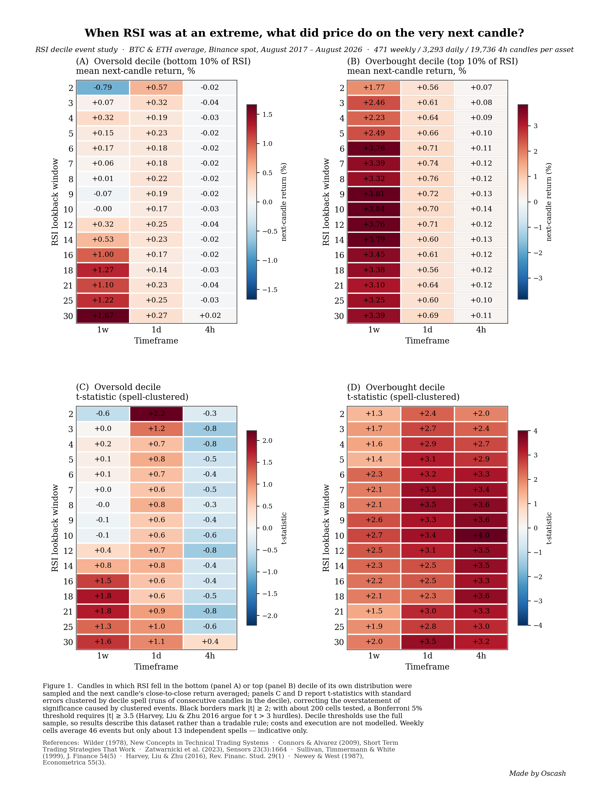
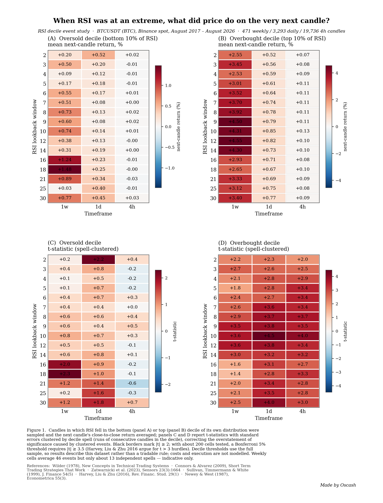
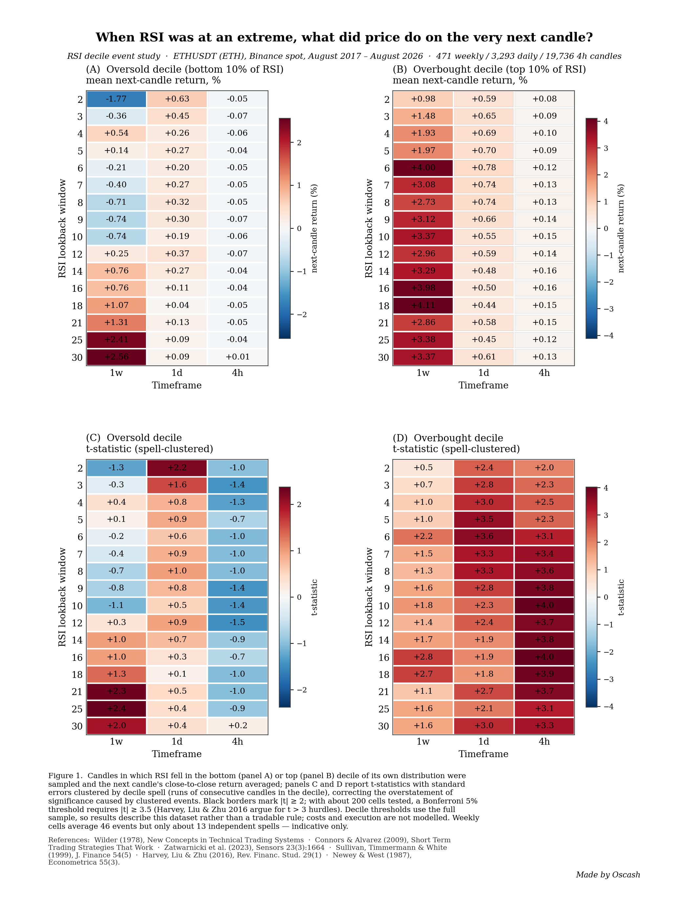

# When RSI was at an extreme, what did price do on the very next candle?

A decile event study of RSI lookback windows (2–30) and StochRSI on **BTC** and **ETH**,
across **weekly, daily, and 4-hour** candles — with statistics held to quant-research
standards: spell-clustered standard errors, multiple-testing disclosure, split-half
stability checks, and net-of-cost backtests.

**Author:** osnava · figures credited to *Oscash* · August 2026

---

## Abstract

Using Binance spot candles for BTCUSDT and ETHUSDT (August 2017 – August 2026; 471 weekly,
3,293 daily, 19,736 4-hour bars per asset), we sample every candle in which RSI falls in the
bottom or top decile of its own distribution and measure the next candle's close-to-close
return. RSI lookbacks of 2–30 are tested per timeframe, plus StochRSI (7/14/21, 14, 3, 3).
t-statistics use standard errors clustered by decile spell; with ~200 cells tested, a
multiple-testing-corrected 5% threshold requires |t| ≥ 3.5.

**Findings.**

1. **Overbought is followed by continuation, not reversal, on every timeframe** — the
   momentum result. Daily and 4h cells clear |t| = 2 and most clear the |t| = 3.5 bar
   (clustered t up to ~4).
2. **There is no reliable oversold bounce in crypto.** The only candidate is daily RSI-2
   (+0.57%/bar avg BTC+ETH, clustered t = 2.2): it survives clustering but not the
   multiple-testing bar, and flips sign between sample halves.
3. **Weekly is momentum with thin evidence** — positive decile returns for nearly all
   windows, but each weekly cell rests on ~46 events / ~13 independent spells.
4. **StochRSI adds no incremental information over RSI** on 4h and daily (IC ≈ 0); the
   only signal appears on weekly with RSI length 21, pointing the same direction as
   plain RSI momentum.
5. **Costs dominate at 4h**: short-window momentum churns away its edge at 0.1% per side;
   only slower windows (14) survive net of costs.

Practical window picks (this sample, trend-following use): **1w: RSI 6–9 · 1d: RSI 14
(RSI 2–4 optional pullback-timing overlay) · 4h: RSI 14**. Evidence favours using RSI as
a trend filter (long while RSI > 50) over classic 30/70 reversal logic — consistent with
Zatwarnicki et al. (2023), whose RSI>50 rule beat buy-and-hold while their oversold/
overbought rule did not.

## Figures

| | |
|---|---|
|  | BTC + ETH average |
|  | BTC only |
|  | ETH only |

Panels: (A) oversold decile mean next-candle return, (B) overbought decile, (C)/(D) the
corresponding spell-clustered t-statistics. Black borders mark |t| ≥ 2. All disclosures
(full-sample decile thresholds, no transaction costs in the event study, weekly sample
size) are in the figure caption.

## Repository layout

```
scan.py           data fetch/cache (Binance, Bybit fallback) + full window scan
hac_tstats.py     statistical audit: spell-clustered t-statistics
followup.py       compounded momentum vs buy-and-hold, 4h cost sensitivity
paper_heatmap.py  research-paper figures (results_ic*.csv -> figures/*.png)
check_heatmap.py  figure layout verification (label fit, block collisions)
results/          all CSV outputs (committed)
figures/          all figures (committed)
data/             cached candles (NOT committed; fetched on first run)
```

## Reproduce

```bash
pip install -r requirements.txt
python scan.py           # fetches data/ on first run, writes results/*.csv
python hac_tstats.py     # writes results/results_ic_clustered.csv
python followup.py       # net-of-cost momentum backtests
python paper_heatmap.py  # writes figures/heatmap{,_btc,_eth}.png
python check_heatmap.py  # verifies figure layout
```

RSI is Wilder-seeded (SMA seed, recursive smoothing) — not the `ewm(alpha=1/n)`
approximation; the two differ early in each sample. Backtests pay 0.1% per side and fill
at the next bar's open. Data source: Binance public klines API (fallback: Bybit v5).

## Methodology and statistical audit

- **Clustered events.** RSI stays in a decile for consecutive candles; i.i.d. t-statistics
  overstate significance. All reported t-statistics cluster standard errors by decile
  spell (the Newey–West / Hansen–Hodrick tradition for autocorrelated event returns).
- **Multiple testing.** ~200 cells are tested; the Bonferroni 5% bar is |t| ≥ 3.5,
  consistent with Harvey, Liu & Zhu (2016), who argue t > 3 hurdles for multiply-tested
  factors. Pattern-level agreement across cells is weighted over any single cell.
- **In-sample thresholds.** Decile cut-offs use the full sample; the event study is
  descriptive of this dataset, not a tradable rule. Momentum backtests are net of costs.
- **Stability.** Split-half Spearman correlations flip sign for daily windows — the
  "best" daily window is regime-dependent, echoing the data-snooping results of Sullivan,
  Timmermann & White (1999).

## Limitations

Two survivor assets (BTC, ETH), one exchange, nine years of a single market regime mix.
Weekly estimates are indicative only. The event study does not model costs or execution;
the backtests model a flat 0.1% per side with next-open fills. Nothing here is investment
advice.

## References

- J. W. Wilder (1978), *New Concepts in Technical Trading Systems*
- L. Connors & C. Alvarez (2009), *Short Term Trading Strategies That Work*
- M. Zatwarnicki, K. Zatwarnicki & P. Stolarski (2023), "Effectiveness of the Relative
  Strength Index Signals in Timing the Cryptocurrency Market," *Sensors* 23(3):1664
- R. Sullivan, A. Timmermann & H. White (1999), "Data-Snooping, Technical Trading Rule
  Performance, and the Bootstrap," *Journal of Finance* 54(5)
- Y. Harvey, Y. Liu & X. Zhu (2016), "…and the Cross-Section of Expected Returns,"
  *Review of Financial Studies* 29(1)
- W. K. Newey & K. D. West (1987), *Econometrica* 55(3)

## License & citation

MIT — see [LICENSE](LICENSE). Citation metadata in [CITATION.cff](CITATION.cff).
